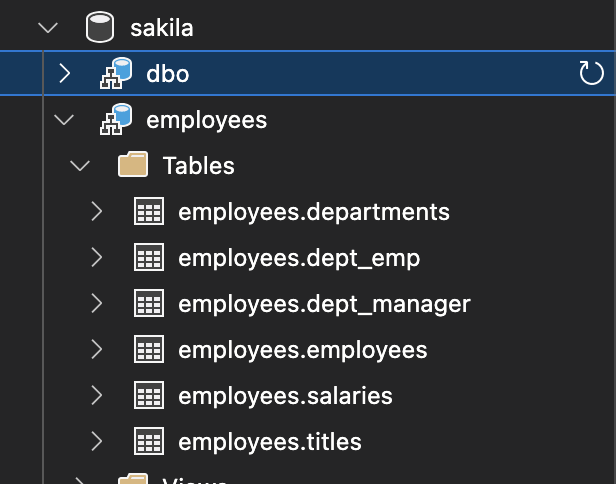

# Serverless Analytics with Lake Formation and Apache SuperSet
A Serverless Cloud Based Analytics Architecture for Everyday DataSets

This project explores the viability of using AWS Lake Formation for analytical queries. At the core Lake Formation involves storing Ser/De files of data in S3 and then querying them using Athena. 

Ser/De files can be Avro, Parquet, ORC, JSON, or any format supported by the Athena query engine (which is also used by AWS Redshift Spectrum). File formats determine performance, with Apache Parquet columnar storage format showing the best performance and JSON providing the slowest query times. 

For query time evaluation purposes, Apache Parquet was used due to its performance profile. 

Using Athena for Analysis provides an extremely cost-effective serverless architecture for analysis tasks where the data volumes are not large enough to benefit from AWS Redshift. Most small to medium sized organizations do not have hundreds of gigabytes of data to analyze, and can't benefit from the MPP architecture of technologies like Redshift.  Using row based RDS instances for smaller datasets results in moderate cost savings, but requires uncessary ETL work and suffers from legacy data modelling constraints associated with using RDBMS systems for analytical workloads.

Serverless query engines such as Athena combined with columnar storage formats such as Apache Parquet and object storage such as S3 offer a modern, agile and cost effective solution for small to medium dataset business intelligence analytics.

Legqcy tools like Tableau, Power BI and others can all leverage Athena directly via optimized JDBC/ODBC drivers. 

Athena supports full ANSI SQL, including Window functions, and most recently has added Views. 

Apache Superset provides an open and scalable visualization platform (without the subscription wall).

This project will evaluate this architecture from a number of perspectives over time, with the initial focus on comparison performance to traditional RDBMS.

## Athena vs. Local MS SQL Server Query Performance

A local SQL Server database containing the MySQL example “employees” database was used as the source (from the collection of MySQL sample databases): 

- Six normalized tables 

- 300,000+ employee records 

- Approx 157MB of data (uncompressed) 

A semi-complex query joining all the tables was created. 

The SQL Server was hosted on an __i9 Macbook Pro w/ 64GB of memory and NVMe with plenty of IOPs__. 

Query response times and result set counts were noted directly against the SQL Server. 

The data was then exported to Apache Parquet format as six files and uploaded to S3, where it was crawled by AWS Glue and registered in AWS Lake Formation. 

The same query was then adjusted for the Lake Formation naming, and query response times and counts were noted using Athena against S3 and compared. 

### Workflow 

The workflow for the test was as follows: 

1. Export SQL Server database tables as Apache Parquet files using [odbc2parquet](https://github.com/pacman82/odbc2parquet). 

2. Upload files as RAW extract data to AWS S3 Bucket. 

3. Configure Glue Crawler to register schemas in Lake Formation database. 

4. Treat Lake Formation database as datastore and query with Athena 

5. Review Performance 

## Performance Test Results 

Six source tables in SQL Server: 

Exported to compressed Parquet files: 

  
Uploaded to S3 (each in own folder for Athena compatibility): 

 
Queried using Athena: 

 
Athena query times for the complex query were slightly less than queries executed against the well provisioned SQL Server database: 

 
Athena: 

 
Result counts match for both the local and Athena query, but Athena was slightly faster at 2.994s as compared to native 3.1s. 

Athena has the demonstrated performance to provide a solid analytical backend in Lake Formation directly to data visualization platforms such as Superset and Tableau.   Glue provides integrated serverless ELT and shared Data Catalog completing Lake Formation as a fully serverless analytics platform.  Serverless workflows can be event driven and kick off with the arrival of new Ser/De data into pre-existing table folders, leveraging other AWS services such as Lambda and Step Functions. 

When additional performance is required, data sets can be easily and seamlessly moved into Redshift for enhanced performance on an as-needed basis. 

Cost effective and serverless, this platform has the potential to service many modern BI use cases for a fraction of the cost of traditional server-based solutions.  

> More to come as this platform is explored further... stay tuned.